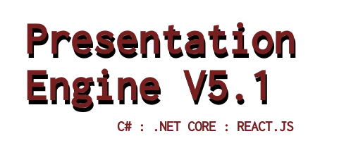

# This Project Is No Longer Being Maintained

Presentation Engine has been a core part of my web presence for over 20 years, but alas its time has come to an end.  If you wish to take over this project, you may absolutely create your own fork.  If you'd like that fork listed here as the recommended transition path, please reach out to me as I am more than willing to discuss that with a properly motivated developer.

However that having been said, my current recommendation is that CMS systems are more trouble than they are worth due to the fact they are obvious targets for hackers and rarely do anything better and quicker than a static website.  That having been said, I recommend any current users strongly consider adopting a superior security posture by transitioning to a static site generator like [Hugo](https://gohugo.io/).  That is what I have done for my remaining personal websites.

# Original Read Me

This repo is the code which runs my personal website https://jaylittle.com

### 1. Would you recommend using this right now?

It screams like a bat out of hell and is relatively secure. If you don't like those things, don't use it now.  Use WordPress instead.

### 2. What the hell is this project anyway?

My rendition of a basic blog.  It powers my primary websites.

### 3. Your previous versions didn't have a license? What gives?

I've gotten old enough to give a shit. FOSS has done a lot of good for me over the years and its well past time I start returning the favor.

### 4. FOSS? This is .NET you silly man!

Yeah this port is being developed 100% on Linux.  The goal is for it to be able to work in a cross platform context, but I will be primarily developing it using tools available to me on various Linux Distributions.

### 5. What tools will I need?

VS Code is my primary development tool because its free and works great. Beyond that I use Krita for the graphical work.

### 6. What changed in the most recent major build?

5.1 contains a number of major changes.  First of all, we have transitioned the admin tools of the application from the Vue.js framework to the React.js framework.  As a professional software developer, I have finally decided to jump on the React bandwagon as it is clear that Vue.js developers aren't really in demand.  In addition this release now supports the use of docker for building and deploying the application.  Beyond that very little of the actual server side code and non-admin end user experience was changed between the most recent release of 5.0 and 5.1.

### 7. What do I need to have installed to run this?

Depending on how you want to build and deploy this application, system requirements will vary.  For a traditional build and deployment process [read this document](Docs/BUILD.md).  For a more modernized container approach [read this document instead](Docs/DOCKER.md).

_Note: As of 8/5/2023, I have made the decision to longer produce traditional release builds for this project.  That means the releases section of the Github will no longer be maintained.  I strongly suggest all users either migrate to using the docker version or take the time to generate your own builds.  The build script will continue to be maintained._

### 8. Do I need a webserver to host this app?

Regardless of whatever deployment method you choose to utilize, I strongly urge you to host this application using a reverse proxy via nginx as exposing ASP.NET Core apps hosted via Kestrel directly is not the best practice.  While this is not a topic, I'm prepared to cover in vast amounts of detail, I've included a sample nginx site configuration below to assist you in this.  Note this configuration redirects all HTTP users to HTTPS and it redirects www.domain.com requests to domain.com.  Feel free to tweak this appropriately per your specific needs.

    server {
        listen              80 default;
        listen              [::]:80 default;
        server_name www.domain.com domain.com;
        access_log off;
        error_log off;
        ## redirect http to https ##
        return      301 https://$host$request_uri;
    }

    server {
        listen              443 ssl http2;
        listen              [::]:443 ssl http2;
        server_name         www.domain.com;
        ssl_certificate     /etc/letsencrypt/live/www.domain.com/fullchain.pem;
        ssl_certificate_key /etc/letsencrypt/live/www.domain.com/privkey.pem;
        return      301 https://domain.com$request_uri;
    }

    server {
        listen              443 ssl http2;
        listen              [::]:443 ssl http2;
        server_name         domain.com;
        ssl_certificate     /etc/letsencrypt/live/domain.com/fullchain.pem;
        ssl_certificate_key /etc/letsencrypt/live/domain.com/privkey.pem;

        ## Redirect any older URLs from versions of the site hosting via a subdirectory rather than at the root (optional) ##
        rewrite ^/domain/(.*)$ /$1 permanent;

        location / {
            proxy_pass http://127.0.0.1:5001;
            proxy_http_version 1.1;
            proxy_set_header Upgrade $http_upgrade;
            proxy_set_header Connection keep-alive;
            proxy_set_header Host $host;
            proxy_cache_bypass $http_upgrade;
            proxy_set_header X-Forwarded-For $proxy_add_x_forwarded_for;
        }
    }
